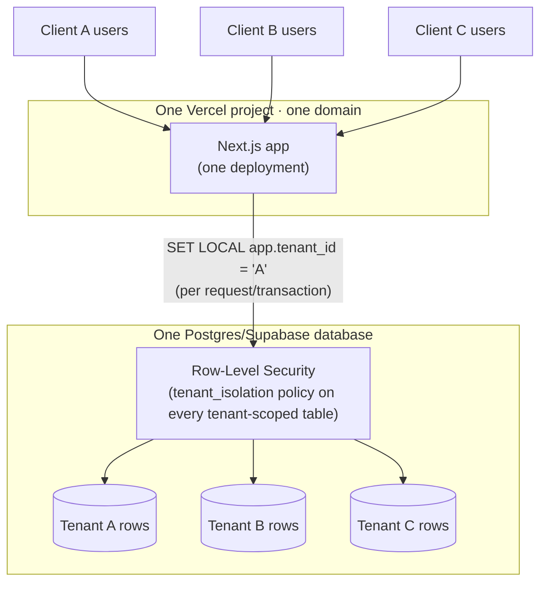
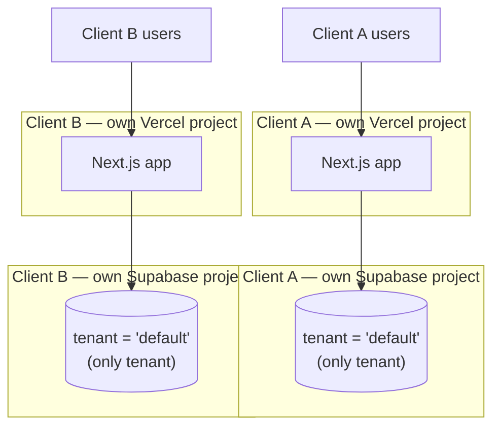
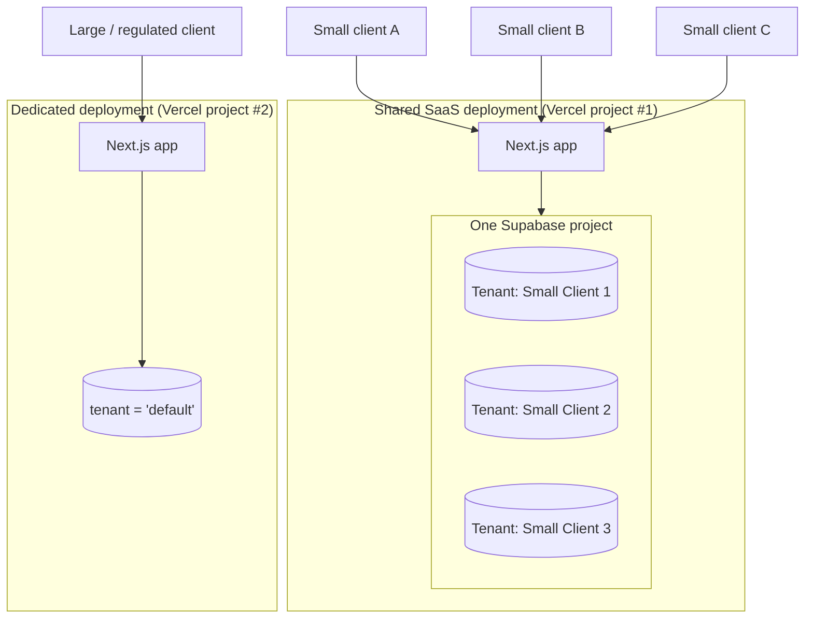

# Shared SaaS vs. Dedicated Client Deployment

This document explains, in terms of what is actually built (not aspirational),
the two ways a client can run this codebase, and the hybrid middle ground.
It is the reference `docs/CLIENT-DEPLOYMENT-RUNBOOK.md` §7 (Client
isolation) points to.

## Why both models exist in one codebase

The codebase has been through two, chronologically distinct architectural
decisions that are both still true today, layered on top of each other:

1. **`docs/adr/0002-domain-model.md`** (2026-08-21, original): "deployment-level,
   not row-level" multi-tenancy — **no `tenantId` column anywhere**,
   isolation by giving every client their own database/Vercel
   project/domain. This is the **Dedicated Client** model below.
2. **`docs/adr/0023` through `0027`** (2026-09-06 to 2026-09-07, later phases):
   added a `Tenant` model, a `tenantId` column on every business/data
   model (35 at the time those ADRs were written; 42 as of the current
   schema — new features keep adding more, each picked up automatically,
   see below), a request-scoped tenant context, Postgres Row-Level
   Security, and invitation-based tenant provisioning (a `/platform` area
   for creating/suspending tenants). This is the **Shared SaaS** model
   below.

**Both are real and currently deployed.** Nothing was removed when the
second was added — a single deployment can run with exactly one tenant
(the bootstrap tenant, `id = "default"`, created by `prisma/seed.ts`) and
behaves exactly like the original one-client-per-deployment model, or it
can run with many `Tenant` rows sharing one deployment. `README.md`'s own
"Deployment (Vercel)" section still describes the pre-multi-tenant,
one-database-per-client story (`docs/adr/0002`'s wording, "no `tenantId`")
and has not been rewritten to reflect ADR 0023-0027 — **treat this
document and `docs/adr/0023`-`0027` as the current source of truth for
isolation architecture, not that section of the README.**

## A) Shared SaaS

One Vercel project, one Postgres/Supabase database, one domain. Every
client is a `Tenant` row. Isolation is enforced at two independent layers:

- **Application layer** (`docs/adr/0024`, `0025`): every Prisma call for
  a tenant-scoped model (every model carrying a `tenantId` column in
  `prisma/schema.prisma` — 42 of them as of the current schema, derived
  automatically at runtime from Prisma's own DMMF, not a hardcoded list)
  is automatically scoped to the active tenant by a Prisma Client
  Extension (`src/lib/tenant/extension.ts`). An explicit foreign
  `tenantId` in a query is rejected outright (`TenantIsolationError`).
- **Database layer** (`docs/adr/0026`): Postgres Row-Level Security,
  `FORCE`d, on every one of those tables — even a bug in the
  application layer, a raw SQL query, or a nested Prisma write cannot
  cross tenants, **provided** the app's `DATABASE_URL` connects as the
  restricted, non-superuser, `NOBYPASSRLS` runtime role
  (`scripts/provision-production-role.sql`). A new tenant-scoped model
  added later is picked up by both layers automatically (same
  DMMF-driven scan), and its migration must add the matching RLS policy
  by hand (RLS policies aren't representable in `schema.prisma` — see
  `docs/adr/0026`).

**How a request resolves its tenant** (`src/lib/tenant/resolve.ts`): the
active session's `User.tenantId` — never a request header, cookie value,
or anything client-supplied. Login itself (`src/actions/auth.ts`) looks a
submitted email up across *every* tenant (`email` is unique per-tenant,
not globally, since ADR 0025) and disambiguates by whichever candidate's
password verifies. The two webhook routes
(`src/app/api/webhooks/{woocommerce,shopify}/route.ts`) resolve the
tenant by testing the request's HMAC signature against every stored
`Integration` row for that provider across every tenant — **the webhook
URL itself is not tenant-specific**; there is exactly one
`/api/webhooks/woocommerce` and one `/api/webhooks/shopify` for the whole
deployment, shared by every tenant connected to that provider.

**Provisioning a new tenant on a shared deployment**: a platform admin
(`User.isPlatformAdmin = true` — a flag independent of RBAC roles, see
`docs/adr/0027` §1) uses `/platform` to create a `Tenant` row and issue
that tenant's first `Invitation` (OWNER role) in one action. See
`docs/CLIENT-DEPLOYMENT-RUNBOOK.md` §8.

**What is genuinely shared, and therefore NOT isolated between tenants on
this model**:

| Shared resource | Consequence |
| --- | --- |
| `INTEGRATION_ENCRYPTION_KEY` / `BACKUP_ENCRYPTION_KEY` | One key protects every tenant's credentials in this deployment. A compromised key exposes every tenant on it, not just one. |
| `RESEND_API_KEY` / `EMAIL_FROM` | Every tenant's invitation/password-reset/support emails are sent from the same address, through the same Resend account and its rate limits/reputation. |
| `APP_URL` / the domain itself | Every tenant is reached at the same domain — there is no per-tenant subdomain or custom-domain routing built. |
| `SHOPIFY_INTEGRATION_ENABLED` | A deployment-wide flag — cannot be "on" for one tenant and "off" for another on the same deployment (see §13 of the runbook, "should eventually be tenant-specific"). |
| Vercel region, compute, cold starts, Postgres connection pool | One noisy tenant's load (a large sync run, a heavy report) is felt by every other tenant on the same deployment. |
| Uptime / a bad deploy | A regression or outage affects every tenant on the deployment simultaneously. |

**When this model fits**: clients who don't need contractual data
residency/isolation guarantees beyond "RLS-enforced separate rows," who
are fine sharing infrastructure cost and blast radius, and where
onboarding speed (no new Vercel/Supabase project per client) matters more
than physical separation.

## B) Dedicated Client

One Vercel project, one Postgres/Supabase project, one domain — **per
client**. This is `docs/adr/0002`'s original model, still fully
supported: nothing in the multi-tenant work requires more than one tenant
to exist. A dedicated deployment simply never creates a second `Tenant`
row — the bootstrap tenant (`id = "default"`, created by
`prisma/seed.ts`) is the only one, forever.

**Isolation guarantee**: total, at the infrastructure level. Separate
compute, separate database, separate domain, separate encryption keys,
separate email sending identity, separate Google Drive backup
destination, separate Resend account if desired. A bug, an outage, a
credential leak, or a noisy-neighbor load spike in one client's
deployment cannot reach another's — there is no shared process or
database to reach.

**Cost**: one Vercel project + one Supabase project (its own billing) per
client; every environment-variable/domain/backup/RLS-role setup step in
`docs/CLIENT-DEPLOYMENT-RUNBOOK.md` is repeated per client, from scratch.

**When this model fits**: clients who require contractual data
residency, a dedicated domain with no shared infrastructure, regulatory
requirements, or simply enough scale/revenue to justify dedicated
infrastructure cost — see also `docs/CLIENT-DEPLOYMENT-RUNBOOK.md` §14
(Scaling) for the operational bottlenecks a shared deployment accumulates
as tenant count grows, which is the other reason to split a client out.

## C) Hybrid model

Both A and B are the *same codebase* — the difference is purely how many
`Tenant` rows exist in a given deployment's database and whether
`/platform` is used to add more. Nothing prevents running both models
side by side across your client base:

Concretely, this means:

- Start every new small/medium client on the **Shared SaaS** deployment
  via `/platform` — fastest onboarding, lowest infrastructure overhead,
  covered in `docs/CLIENT-DEPLOYMENT-RUNBOOK.md` §8.
- When a client outgrows the shared deployment (needs dedicated
  infrastructure, hits a noisy-neighbor problem, signs a contract
  requiring physical isolation, or the shared deployment approaches the
  scaling bottlenecks in §14), **migrate them out**: export their tenant's
  data using the Backup & Portability module (`docs/adr/0034`) — an
  `.asb` package is tenant-scoped and secret-free by construction — stand
  up a new dedicated Vercel + Supabase project for them (§2/§3 of the
  runbook), and restore the package into that new deployment's bootstrap
  tenant.
- **Caveat, stated plainly**: the Backup & Portability module's restore
  path (`docs/adr/0034` "Tenant isolation") refuses a restore where
  `manifest.tenant.id !== activeTenantId` — cross-tenant/cross-deployment
  restore (i.e., restoring tenant B's export into a fresh deployment
  whose bootstrap tenant is `"default"`, a *different* id) is an explicit
  **non-goal of Phase 1/2** and is **not implemented**. Today, moving a
  tenant off a shared deployment onto its own dedicated one requires a
  manual data migration (a database-level export/import matching ids), not
  a one-click "restore elsewhere." Building a guided
  export-from-shared → import-into-dedicated flow (ID-remapping restore
  mode) is exactly the kind of future work `docs/adr/0034` names as
  deferred — flag it to the owner before promising a client this
  migration path on a deadline.
- Large/enterprise clients, or anyone requiring dedicated infrastructure
  from day one, go straight to a **Dedicated** deployment.

## Decision guide

| Question | Shared SaaS | Dedicated |
| --- | --- | --- |
| Client needs a contractual/regulatory guarantee of physical data isolation? | No | Yes |
| Client wants the fastest possible onboarding (minutes, not a new cloud project)? | Yes | No |
| Client is cost-sensitive / small scale? | Yes | No (own Vercel + Supabase billing) |
| Client needs a fully custom domain with zero shared infrastructure? | No (shared domain) | Yes |
| You expect this client to generate meaningfully more load than others sharing the deployment? | No — noisy-neighbor risk | Yes |
| Client needs Shopify but others on the same deployment must not? | Not possible today (`SHOPIFY_INTEGRATION_ENABLED` is deployment-wide) | Yes |
| You want one codebase deploy/update to reach many clients at once? | Yes | No — each dedicated deployment is updated independently |

See `docs/CLIENT-DEPLOYMENT-RUNBOOK.md` for the exact provisioning steps
for both models.
